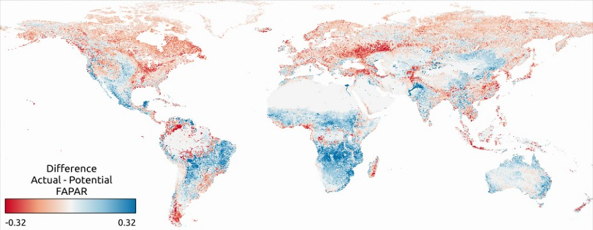

# Global_FAPAR_250m
Land potential assessment based on 2000--2021 FAPAR monthly time-series at 250 m resolution

Preliminary global maps of monthly FAPAR time series, FAPAR long-term trend and potential FAPAR predictions at 250 m spatial resolution are available at Zenodo.

**Summary**: This repository provides code used to model actual FAPAR and predict potential FAPAR using Ensemble Machine Learning (EML) and time series data 2000--2021.  

**FAPAR gap of actual vs. potential FAPAR**

General steps:
- Overlaying global training points with time series data of monthly FAPAR and biophysical covariates (climate, geology, vegetation, nightlights, cropland intensity etc.)
- Training and evaluation of EML model to predict (actual) FAPAR using 5-fold spatial CV with blockage on the geographic location
- Prediction of potential FAPAR by removing the impact of urbanisation and intensive agriculture
- Calculating difference between actual and potential FAPAR per pixel

# OEMC hackathon: Global FAPAR
Data used for the hackathon is available at https://zenodo.org/record/8306613. 
See https://www.kaggle.com/competitions/oemc-hackathon-global-fapar-modeling for the competition hosted in October 2023. 

# Disclaimer
These are preliminary maps. The code and data will be submitted for scientific review. Errors and artifacts are still possible. To report an issue or artifact in maps, please use https://github.com/Open-Earth-Monitor/Global_FAPAR_250m/issues.
